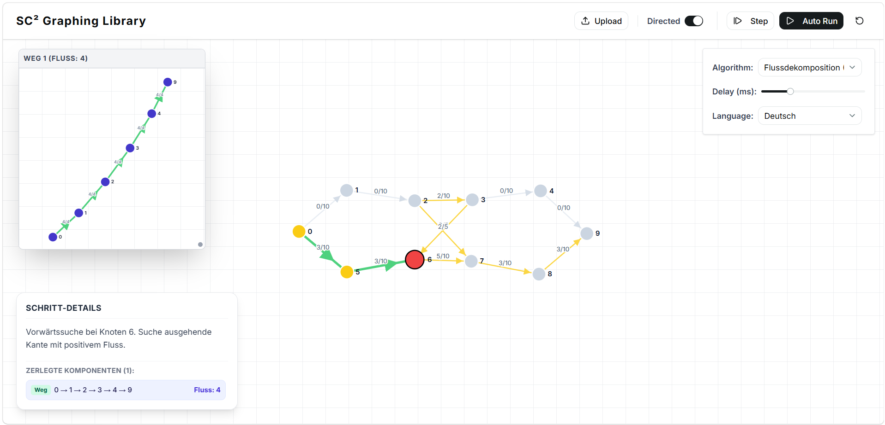

# SC² Graphing Library (`graphing-lib-ts`)

A TypeScript graph library and interactive visualization workbench for graph algorithms, network flows, and combinatorial optimization.



---

## Key Highlights

- **Strongly Typed Graph Core**: Generic `Graph<T, IsDirected, E>` supporting arbitrary node types with a discriminated union of edge structures (`unweighted`, `weighted`, `flow`, and `residual`).
- **Generator-Driven Algorithm Execution**: Algorithms are implemented as TypeScript Generators that yield discrete step states, powering step-by-step stepping, state inspection, and timeline scrubbing.
- **Interactive Visualization**: React 19 + D3 force-directed canvas with multi-window support for sub-graphs (e.g. decomposed flow paths, residual networks).
- **Bilingual Step Annotations**: Localized (English & German) real-time explanations for each algorithm step.

---

## Implemented Algorithms

| Category          | Algorithm                | Generator / Entry Point                                                       | Description                                                      |
| :---------------- | :----------------------- | :---------------------------------------------------------------------------- | :--------------------------------------------------------------- |
| **Connectivity**  | Connected Components     | [`countConnectedComponentsGenerator`](src/algorithms/search.ts)               | BFS/DFS traversal counting components                            |
| **MST**           | Prim's Algorithm         | [`primsAlgorithmGenerator`](src/algorithms/mst.ts)                            | Priority-queue-based Minimum Spanning Tree                       |
|                   | Kruskal's Algorithm      | [`kruskalsAlgorithmGenerator`](src/algorithms/mst.ts)                         | Disjoint-set (Union-Find) MST                                    |
| **SSSP**          | Dijkstra                 | [`dijkstraGenerator`](src/algorithms/sssp/dijkstra.ts)                        | Min-heap single-source shortest path                             |
|                   | Bellman-Ford             | [`bellmanFordGenerator`](src/algorithms/sssp/bellmanFord.ts)                  | SSSP supporting negative weights & cycle detection               |
| **TSP**           | Nearest Neighbor         | [`nearestNeighborTspGenerator`](src/algorithms/tsp/nearestNeighborTsp.ts)     | Greedy TSP heuristic                                             |
|                   | Double Tree              | [`doubleTreeAlgorithmGenerator`](src/algorithms/tsp/doubleTreeTsp.ts)         | 2-approximation via MST doubling & shortcutting                  |
|                   | Brute Force              | [`bruteForceTspGenerator`](src/algorithms/tsp/bruteForceTsp.ts)               | Exact optimal TSP tour via permutation search                    |
|                   | Branch & Bound           | [`branchAndBoundTspGenerator`](src/algorithms/tsp/branchAndBoundTsp.ts)       | Exact TSP using 1-tree lower bounds                              |
| **Flow**          | Edmonds-Karp             | [`edmondsKarpGenerator`](src/algorithms/edmondsKarp.ts)                       | Max flow with augmenting paths via BFS                           |
|                   | Flow Decomposition       | [`flowDecompositionGenerator`](src/algorithms/flowDecomposition.ts)           | Decomposes circulation/flow into simple $s$-$t$ paths and cycles |
| **Min-Cost Flow** | Cycle Canceling          | [`cycleCancelingGenerator`](src/algorithms/cycleCanceling.ts)                 | Eliminates negative cost residual cycles via Bellman-Ford        |
|                   | Successive Shortest Path | [`successiveShortestPathGenerator`](src/algorithms/successiveShortestPath.ts) | Primal-dual MCF via node potentials and reduced costs            |

---

## Architecture & Project Structure

```
graphing-lib-ts/
├── docs/assets/               # Documentation assets and screenshots
├── graphs/                    # Sample graph benchmark datasets (.txt)
│   ├── directed/              # Directed benchmark graphs
│   ├── flow/                  # Max flow test networks
│   ├── mcf/                   # Min-Cost Flow networks with node balances
│   ├── metric/                # Metric TSP instances (complete graphs)
│   └── weighted/              # Weighted graph benchmarks
├── src/
│   ├── core/                  # Graph data structure & edge types
│   │   ├── Graph.ts           # Adjacency-list Graph<T, IsDirected, E>
│   │   └── types.ts           # UnweightedEdge, WeightedEdge, FlowEdge, ResidualEdge
│   ├── algorithms/            # Core algorithm generators & data structures
│   │   ├── datastructures/    # PriorityQueue, UnionFind
│   │   ├── sssp/              # Dijkstra, Bellman-Ford
│   │   ├── tsp/               # Double Tree, Nearest Neighbor, Branch & Bound
│   │   ├── edmondsKarp.ts     # Max flow
│   │   ├── flowDecomposition.ts # Flow decomposition into paths & cycles
│   │   ├── cycleCanceling.ts  # Min-cost flow (Cycle-Canceling)
│   │   └── successiveShortestPath.ts # Min-cost flow (SSP)
│   ├── io/                    # File readers & Zod-validated streaming parsers
│   │   ├── parser.ts          # createGraphParser, parseMixedGraph, parseMinCostFlowGraph
│   │   ├── node-reader.ts     # Node.js readline streaming
│   │   └── browser-reader.ts  # Browser File reader
│   ├── ui/                    # UI state adapters and React hook runners
│   │   ├── adapters.ts        # Visualizer adapters wrapping algorithm generators
│   │   └── hooks/             # useAlgorithmRunner (play/pause/step/delay)
│   ├── components/            # React UI components (GraphCanvas, SubWindow, TopBar)
│   └── lib/                   # Localization dictionaries and utilities
└── tests/                     # Vitest test suites and lab benchmark tests
```

---

## Getting Started

### Prerequisites

- Node.js `>= 20.0.0`
- [pnpm](https://pnpm.io/) `>= 10`

### Installation

```bash
pnpm install
```

### Development Scripts

| Command           | Description                                                  |
| :---------------- | :----------------------------------------------------------- |
| `pnpm dev`        | Start Vite development server at `http://localhost:5173`     |
| `pnpm build`      | Run TypeScript type checks (`tsc`) and bundle for production |
| `pnpm preview`    | Locally preview production Vite build                        |
| `pnpm test`       | Run test suite with Vitest in watch mode                     |
| `pnpm vitest run` | Run test suite once                                          |
| `pnpm format`     | Check and format code with Prettier                          |

---

## Programmatic Usage

### 1. Constructing and Querying Graphs

```typescript
import { Graph } from "@/core/Graph";
import type { WeightedEdge } from "@/core/types";

// Create an undirected weighted graph
const graph = new Graph<number, false, WeightedEdge<number>>(false);

graph.addEdge({
  kind: "weighted",
  from: 0,
  to: 1,
  weight: 4.5
});

const neighbors = graph.getNeighbors(0);
```

### 2. Stepping Through an Algorithm Generator

All algorithms expose generator functions yielding discrete evaluation states:

```typescript
import { primsAlgorithmGenerator } from "@/algorithms/mst";

const generator = primsAlgorithmGenerator(graph);

for (const step of generator) {
  console.log("Current Node:", step.currentNode);
  console.log("MST Edges:", step.mstEdges);
  console.log("Step Note:", step.notes.en);
}
```

### 3. Parsing Graph Files

The library reads standard graph benchmark formats:

```typescript
import { readGraphFromFileNode } from "@/io/node-reader";
import { parseMixedGraph } from "@/io/parser";

const lines = readGraphFromFileNode("./graphs/weighted/G_1_2.txt");
const graph = await parseMixedGraph(lines, false);
```

#### Graph File Format

- **First line**: Total number of vertices $|V|$.
- **Min-Cost Flow (MCF)**: Next $|V|$ lines define node balance $b(v)$ for each node $v \in \{0, \dots, |V|-1\}$.
- **Subsequent lines**: Edges formatted with whitespace-separated values:
  - Unweighted: `from to`
  - Weighted: `from to weight`
  - Flow: `from to capacity [flow] [cost]`
  - MCF: `from to cost capacity`
